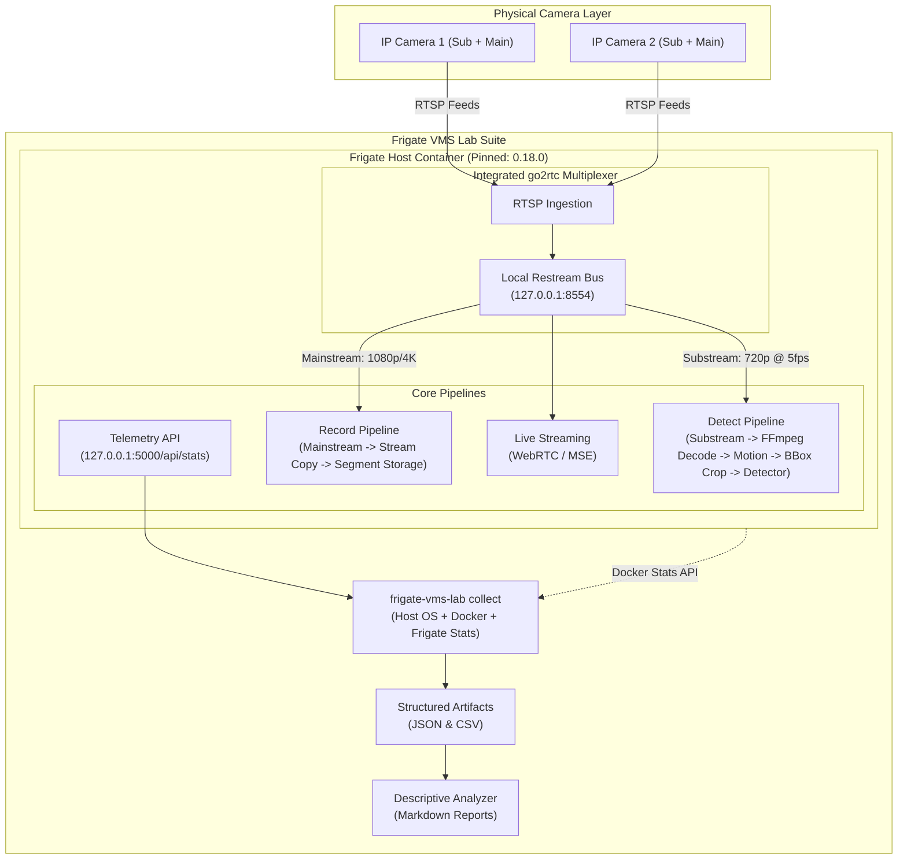

# Frigate VMS Lab

### Experimental Video Management System Performance & Architecture Lab

[](https://github.com/Roojool/Frigate-VMS-Lab/actions/workflows/ci.yml)
[](https://www.python.org/downloads/)
[](https://opensource.org/licenses/MIT)

- **STATUS**: `EARLY RESEARCH TOOLING`
- **UPSTREAM SOFTWARE**: [Frigate](https://github.com/blakeblackshear/frigate)
- **BASELINE REFERENCE VERSION**: `Frigate 0.18.0` (`ghcr.io/blakeblackshear/frigate:0.18.0`)
- **AUTHOR / MAINTAINER**: Rujul Talekar

---

## Research Objective

The primary objective of the **Frigate VMS Lab** is to build a transparent, reproducible experimental environment for studying the performance, resource characteristics, and system architecture of multi-camera Video Management Systems (VMS) utilizing Frigate, integrated go2rtc restreaming, and edge video analytics.

Video surveillance systems present complex trade-offs across network ingestion, video decode bandwidth, motion detection, and neural inference. This project provides rigorous instrumentation, standardized experiment protocols, and descriptive analysis tooling to quantify these dynamics on physical hardware without reliance on guesswork or marketing assertions.

---

## Why This Lab Exists

Deploying a real-time Video Management System with object detection at scale routinely exposes bottlenecks that are poorly understood in consumer and prosumer environments:
1. **Decode vs. Inference Saturation**: Video decoding can become a bottleneck before inference depending on hardware and stream configuration.
2. **Camera Stream Limits**: Physical IP cameras often fail or drop packets when queried by multiple concurrent RTSP clients; utilizing a stream restreamer like go2rtc changes the connection topology.
3. **Resolution Mismatch**: High-resolution video is necessary for forensic recording, yet passing high-resolution streams directly into motion detection may increase decode cost, which EXP-002 is designed to quantify.
4. **Reproducibility Gap**: Anecdotal community configurations lack standardized benchmarking metrics, continuous time-series logging, and controlled independent variables.

This repository bridges that gap by isolating each pipeline stage, capturing defensive telemetry, and enforcing strict privacy and credential safety.

---

## System Architecture

Frigate embeds an **integrated go2rtc instance** by default. IP cameras connect to go2rtc once, and streams are restreamed locally over internal loopback to Frigate's independent detection and recording pipelines:



Detailed architectural specifications and pipeline flowcharts are documented in [`docs/ARCHITECTURE.md`](docs/ARCHITECTURE.md).

---

## Research Questions

The lab addresses ten foundational research questions:

1. **Detection Stream Resolution**: How does detection stream resolution affect resource usage? *(Note: Labeled ground-truth detection accuracy evaluation is reserved for future work).*
2. **Main-Stream vs. Substream Detection**: What is the measured CPU overhead difference between running detection directly on high-resolution main-streams versus dedicated substreams?
3. **go2rtc Restreaming Overhead**: What is the compute and memory footprint of go2rtc restreaming relative to direct ffmpeg ingestion?
4. **Multi-Camera Concurrency**: How do multiple simultaneous camera feeds scale across CPU cores and memory channels on commodity hardware?
5. **Feed Stability**: How stable are physical RTSP feeds over sustained multi-hour runs under fluctuating network conditions?
6. **Detect FPS vs. Source FPS**: How does achieved detection FPS deviate from nominal camera frame rates under varying load conditions?
7. **Decode Resolution & Memory**: What exact effect does decode frame geometry have on shared memory (`/dev/shm`) and resident RAM allocation?
8. **Pipeline Separation**: How should recording and detection pipelines be decoupled to maximize recording fidelity while minimizing compute?
9. **Pre-Inference Bottlenecks**: What system bottlenecks (decode, I/O wait, memory bandwidth) emerge before model inference becomes the limiting factor?
10. **Evaluation Metrics**: Which empirical metrics are most indicative of healthy, long-term VMS deployment stability?

---

## Experiment Matrix

Standardized, reproducible scientific protocols are housed in [`experiments/`](experiments/):

| Protocol ID | Title | Focus Area | Status |
| :--- | :--- | :--- | :--- |
| [`EXP-001`](experiments/EXP-001-baseline.md) | Baseline Single-Camera Resource Profile | 1 Camera, 720p detect, 1080p record, CPU detector | `NOT YET MEASURED` |
| [`EXP-002`](experiments/EXP-002-stream-resolution.md) | Detect Stream Resolution Tradeoffs | 640×360 vs. 1280×720 vs. 1920×1080 | `NOT YET MEASURED` |
| [`EXP-003`](experiments/EXP-003-multi-camera-scaling.md) | Multi-Camera Stream Scaling | 1, 2, and 4 concurrent camera streams | `NOT YET MEASURED` |

---

## Supported Telemetry (Metrics the Tooling Can Collect)

> [!NOTE]
> The metrics listed below define the capabilities of the automated collection tooling. Physical measurements on dedicated hardware have not yet been performed and are marked `NOT YET MEASURED`.

The suite distinguishes pipeline rates defensively to eliminate ambiguous labeling:

- **`camera_fps`**: Rate of video frames consumed directly from the camera feed.
- **`process_fps`**: Rate of video frames decoded and evaluated by motion analysis.
- **`skipped_fps`**: Rate of frames dropped due to CPU or decoder queue starvation (target: `0.0`).
- **`detection_fps`**: Rate of tensor inference executions dispatched to the object detector.
- **System & Container Metrics**: Host CPU %, per-core CPU %, memory usage, load average (Linux), and Docker container stats.

See [`docs/METRICS.md`](docs/METRICS.md) for full mathematical definitions and sampling specifications.

---

## Quick Start

### 1. Installation

Requires **Python 3.10+**:

```bash
git clone https://github.com/Roojool/Frigate-VMS-Lab.git
cd Frigate-VMS-Lab
pip install -e .
```

### 2. Configure Local Environment & Validate Safety

Instantiate your local configuration from the sanitized template:

```bash
# Create local configuration (gitignored)
cp configs/frigate.example.yml configs/frigate.local.yml

# Validate syntax and verify zero private IP or credential leaks
frigate-vms-lab validate-config configs/frigate.local.yml
```

### 3. Deploy Reference Container

Start the Frigate container using the reference Docker Compose deployment:

```bash
# Provide local RTSP password via environment variable
export FRIGATE_RTSP_PASSWORD="your_camera_password"

# Launch Frigate with integrated go2rtc (pinned to 0.18.0, least privilege)
docker compose -f docker/compose.example.yml up -d
```

*(Note: Unauthenticated API port 5000 is bound strictly to `127.0.0.1` for local telemetry collection. Authenticated web UI access via port 8971 may be configured separately).*

### 4. Execute Benchmark Measurement

Run an empirical collection session with a 30-second warm-up window:

```bash
frigate-vms-lab collect \
  --experiment-id EXP-001 \
  --duration 600 \
  --warmup 30 \
  --interval 1.0 \
  --frigate-url http://127.0.0.1:5000 \
  --container frigate \
  --output results/EXP-001_run.json \
  --csv results/EXP-001_timeseries.csv
```

### 5. Analyze & Report

```bash
# Display summary statistics to stdout
frigate-vms-lab analyze results/EXP-001_run.json

# Generate publication-grade Markdown research report
frigate-vms-lab report results/EXP-001_run.json --output results/EXP-001_report.md
```

---

## Example Output

### Structured JSON Schema (`results/run.json`)

```json
{
  "experiment_id": "EXP-001",
  "physical_run_completed": false,
  "timestamp": null,
  "duration_seconds": 600,
  "interval_seconds": 1.0,
  "warmup_seconds": 30,
  "environment": {
    "platform": null,
    "python_version": null,
    "cpu_count_logical": null,
    "memory_total_bytes": null,
    "docker_available": null,
    "frigate_version": null
  },
  "streams": [],
  "samples": [],
  "summary": {
    "total_samples": 0,
    "system": {
      "cpu_percent": {
        "sample_count": 0,
        "mean": null,
        "median": null,
        "min": null,
        "max": null,
        "stdev": null,
        "p50": null,
        "p95": null
      }
    },
    "docker": {},
    "frigate": {
      "cameras": {}
    }
  }
}
```

### Rendered Markdown Report Preview

```markdown
# Experiment Report: EXP-001
- Execution Timestamp (UTC): NOT YET MEASURED
- Benchmark Duration: 600s (Warm-up: 30s)
- Host Platform: NOT YET MEASURED

| Camera | Pipeline Stage | Definition | Samples | Mean | Median | p95 |
| :--- | :--- | :--- | :--- | :--- | :--- | :--- |
| `camera_1` | `camera_fps` | Ingest / Consumed | 0 | NOT YET MEASURED | NOT YET MEASURED | NOT YET MEASURED |
| `camera_1` | `process_fps` | Decode / Processed | 0 | NOT YET MEASURED | NOT YET MEASURED | NOT YET MEASURED |
| `camera_1` | `skipped_fps` | Frame Drops | 0 | NOT YET MEASURED | NOT YET MEASURED | NOT YET MEASURED |
| `camera_1` | `detection_fps` | Detector Invocations | 0 | NOT YET MEASURED | NOT YET MEASURED | NOT YET MEASURED |
```

---

## Current Results

> [!IMPORTANT]
> **Baseline physical experiments are pending.**
> The repository currently provides instrumentation, experiment protocols, configuration examples, and analysis tooling. No benchmark numbers are fabricated.

A strict boundary is maintained:

### IMPLEMENTED
- Automated collection tooling (`frigate-vms-lab collect`)
- Defensive telemetry parsers for `/api/stats` and `/api/version`
- Publication-quality Markdown report generator (`frigate-vms-lab report`)
- Descriptive statistics engine (mean, median, stdev, p50, p95)
- Standardized experiment protocols ([`EXP-001`](experiments/EXP-001-baseline.md), [`EXP-002`](experiments/EXP-002-stream-resolution.md), [`EXP-003`](experiments/EXP-003-multi-camera-scaling.md))
- Sanitized configuration templates with `{FRIGATE_...}` substitution
- Automated CI test suite and credential safety validation

### NOT YET VALIDATED (PENDING PHYSICAL RUNS)
- Physical camera hardware benchmarks
- Mainstream vs. substream CPU overhead quantification
- Integrated vs. external go2rtc comparative overhead
- Multi-camera resolution scaling thresholds
- Hardware accelerator (iGPU, Coral, Hailo-8) comparisons

---

## Reproducibility & Privacy

- **Privacy Protocol**: Strictly enforces zero private footage, no sensitive camera IP addresses, and automated password redaction (`***`). See [`docs/PRIVACY.md`](docs/PRIVACY.md).
- **Research Methodology**: Governed by the four-phase pipeline: *Configured State $\rightarrow$ Observed State $\rightarrow$ Measured Behavior $\rightarrow$ Defensible Conclusion*. See [`docs/METHODOLOGY.md`](docs/METHODOLOGY.md).
- **Hardware Documentation**: Hardware environments must be documented using the neutral template in [`docs/HARDWARE.md`](docs/HARDWARE.md). Windows/WSL2 is categorized as `EXPERIMENTAL / DEVELOPMENT ENVIRONMENT`.

---

## Limitations

- Descriptive observations reflect tested physical conditions only; results do not transfer across differing silicon or sensor architectures without re-measurement.
- Scene motion entropy and camera compression codecs introduce variability.
- Full methodological boundaries are detailed in [`docs/LIMITATIONS.md`](docs/LIMITATIONS.md).

---

## Roadmap

- [x] Standardized experiment protocols (EXP-001, EXP-002, EXP-003)
- [x] Defensive telemetry collectors and CLI tooling
- [x] Sanitized reference configurations with integrated go2rtc (pinned to 0.18.0)
- [x] Config safety and credential leak detection in CI
- [ ] Physical execution of EXP-001 single-camera baseline on Linux x86 hardware
- [ ] Physical execution of EXP-002 resolution comparative trials
- [ ] Physical execution of EXP-003 multi-camera scaling trials
- [ ] Hardware acceleration evaluation: Intel QuickSync (VAAPI) vs. Software CPU
- [ ] Edge accelerator benchmarking: Google Coral TPU and Hailo-8 NPU

---

## Upstream Software Attribution

This project is an independent research and benchmarking lab that interoperates with:

- **Upstream Project**: [Frigate](https://github.com/blakeblackshear/frigate)
- **Baseline Reference Version**: `0.18.0`
- **Upstream License**: MIT License
- **Upstream Copyright**:
  ```text
  MIT License
  Copyright (c) 2026 Frigate, Inc. (Frigate™)
  ```

Frigate and the Frigate logo are trademarks of Frigate, Inc. This lab is not affiliated with, sponsored by, or endorsed by Frigate, Inc.

This repository is licensed under the **MIT License** (Copyright &copy; 2026 Rujul Talekar).

---

## Citation

If you reference this research framework or tooling in your work, please cite:

```bibtex
@software{Talekar_Frigate_VMS_Lab_2026,
  author = {Talekar, Rujul},
  title = {{Frigate VMS Lab: Experimental Video Management System Performance & Architecture Lab}},
  year = {2026},
  url = {https://github.com/Roojool/Frigate-VMS-Lab},
  version = {0.1.0}
}
```
Or use the provided [`CITATION.cff`](CITATION.cff) file.
