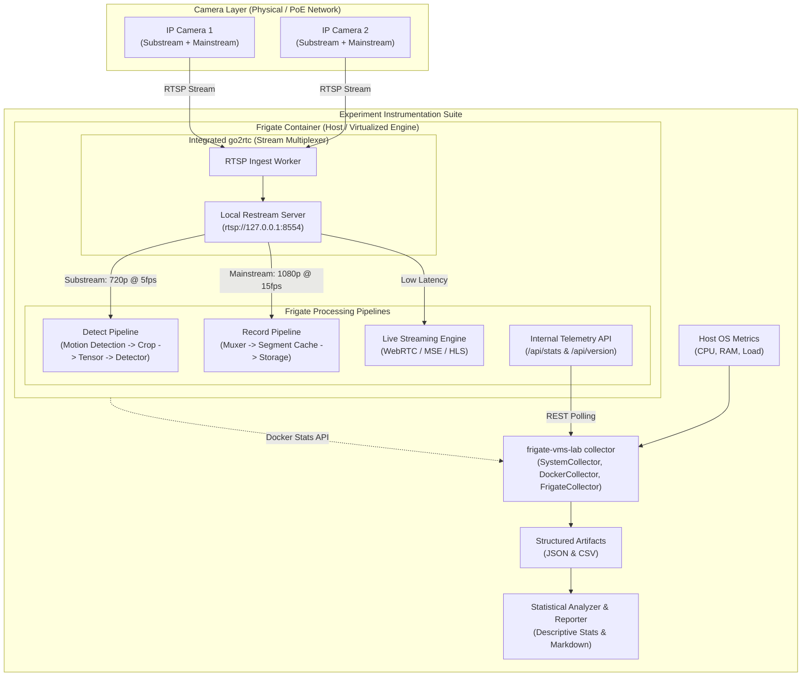
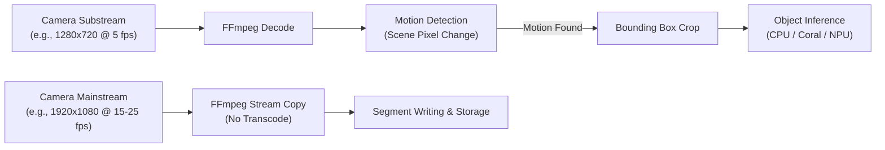

# System Architecture

This document details the architectural topology of the Frigate Video Management System (VMS) lab and its instrumentation framework.

---

## High-Level Topology

Frigate integrates [go2rtc](https://github.com/AlexxIT/go2rtc) internally to manage stream ingestion, transcoding, and restreaming. In the standard lab architecture, cameras stream once into the integrated go2rtc instance, which subsequently fans out streams to Frigate's detection engine, recording engine, and live WebRTC/MSE endpoints.

---

## Why go2rtc Restreaming Matters

IP cameras typically support only a limited number of simultaneous RTSP clients (often 2–4 connections maximum) before their onboard microcontrollers overheat, drop frames, or reset.

Without a restreamer:
1. Frigate detect pipeline opens connection 1.
2. Frigate record pipeline opens connection 2.
3. User live view in web UI opens connection 3.
4. Second mobile client opens connection 4 $\rightarrow$ **Camera limits exceeded / packet loss occurs.**

With Frigate's **integrated go2rtc**:
- The camera transmits exactly **one** network stream per channel to the host.
- Integrated go2rtc receives the stream and shares it locally via internal loopback (`rtsp://127.0.0.1:8554/<name>`).
- Detection, recording, and multi-client live streaming all consume the local restream without imposing network or CPU load on the physical camera.

> [!NOTE]
> While a separate standalone go2rtc container can be deployed, Frigate includes go2rtc natively. The standard lab configuration uses the integrated instance to reflect standard production patterns. A standalone container is evaluated only as an optional advanced experiment.

---

## Detection vs. Recording Pipeline Separation

Frigate decouples video processing into two specialized pipelines:

1. **Detect Pipeline**:
   - Decodes video frames to uncompressed pixel buffers.
   - Requires substantial CPU/GPU decode bandwidth.
   - Run at low resolution (substream: 720p or 360p) and low frame rate (5 fps) to minimize compute overhead.
2. **Record Pipeline**:
   - Performs direct stream copying (`-c copy`) without re-encoding video frames.
   - Minimal CPU utilization.
   - Run at native mainstream resolution (1080p, 4K) to maintain archival evidence quality.
