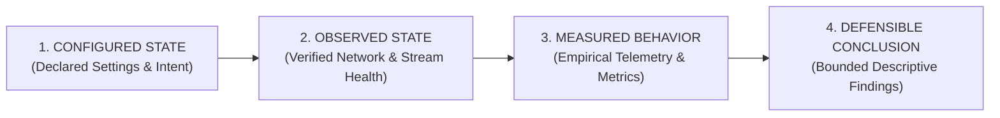

# Research Methodology

The Frigate VMS Lab adheres to an empirical research framework designed to produce reproducible, defensible observations without speculative or fabricated claims.

---

## The Four-Phase Research Framework

Every experiment advances through four distinct stages:

### 1. Configured State
- Declared parameters in `frigate.yml` and `compose.yml`.
- Target resolutions, fps thresholds, detector thread counts, model topologies.
- **Principle**: *Configuration is not proof of performance.* Setting `fps: 5` does not guarantee the pipeline is successfully maintaining 5 fps.

### 2. Observed State
- Verifying that streams actually match configured assumptions.
- Inspecting streams via `ffprobe` to observe actual codec, profile, nominal frame rate, and dimensions delivered by camera firmware.
- Verifying host environment metadata (Linux kernel, CPU architecture, memory headroom).

### 3. Measured Behavior
- Continuous, non-invasive time-series sampling over established trial durations.
- Preceded by a mandatory warm-up window (minimum 30 seconds) to ensure decoder buffer stability and cache priming.
- Metric collection at 1 Hz intervals capturing host CPU/RAM, container stats, and Frigate pipeline rates.

### 4. Defensible Conclusion
- Analysis strictly constrained to descriptive statistics (mean, median, standard deviation, percentiles).
- No assertions of universal superiority or statistical significance without formal experimental control groups and repeated trials.
- Clearly marking baseline states as `NOT YET MEASURED` prior to physical verification.

---

## Core Methodological Principles

### 1. Source FPS vs. Processing FPS
A camera may transmit at 30 fps, but Frigate's detection pipeline may deliberately downsample the stream to 5 fps. Conversely, if decode queues saturate, Frigate will skip frames (`skipped_fps > 0`). Conflating nominal camera frame rate with actual processing frame rate invalidates performance models.

### 2. CPU Utilization Alone Does Not Represent Pipeline Quality
A system running at 90% CPU may be smoothly decoding four 4K streams with zero frame drops. Another system running at 40% CPU may be stuttering due to thread contention or I/O wait on disk writes. CPU metrics must always be correlated with `skipped_fps` and `process_fps`.

### 3. Benchmark Topology Matters
Physical network characteristics directly impact VMS behavior:
- Unmanaged 10/100 PoE switches vs. enterprise gigabit backplanes.
- Packet jitter and MTU fragmentation over long Cat6 runs.
- RTSP over TCP (interleaved) vs. UDP (packet drop tolerance).
All experiment reports must record the physical network topology.

### 4. Camera Firmware and Encoding Variance
Different camera manufacturers (Dahua, Hikvision, Reolink, Axis) implement H.264/H.265 encoders with varying I-frame (GOP) intervals, variable bitrate (VBR) fluctuations, and profile settings. Benchmark results on one camera model cannot be universally applied to all IP cameras.

### 5. Hardware Coupling of Inference Metrics
Inference timings and detector saturation are strictly coupled to specific silicon:
- AVX2/AVX-512 vector support on host CPUs.
- OpenVINO iGPU acceleration.
- PCIe vs. USB Google Coral TPUs.
- Hailo-8 / Hailo-8L NPUs.
Performance findings must specify exact silicon stepping and driver levels.
